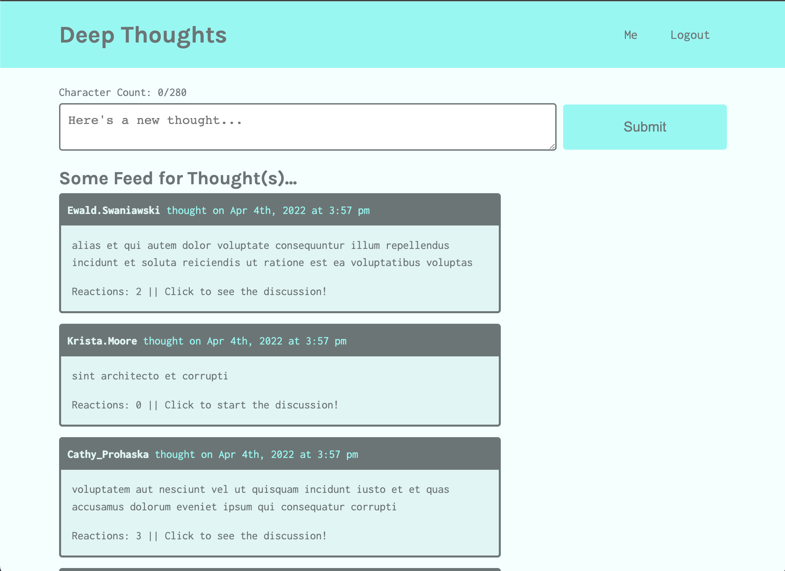

# Deep Thoughts
  
  

## Summary

Social media application where users can create an account, post their thoughts for others to see, and interact with other users through these thoughts.

## Deployment

## Demo/Screenshot

## Questions
  If you have any questions about this project, please open an issue or use the contact information below:
  * [katiechurchwell](https://www.github.com/katiechurchwell)
  * [churchwellcatherine@gmail.com](mailto:churchwellcatherine@gmail.com)

---
  